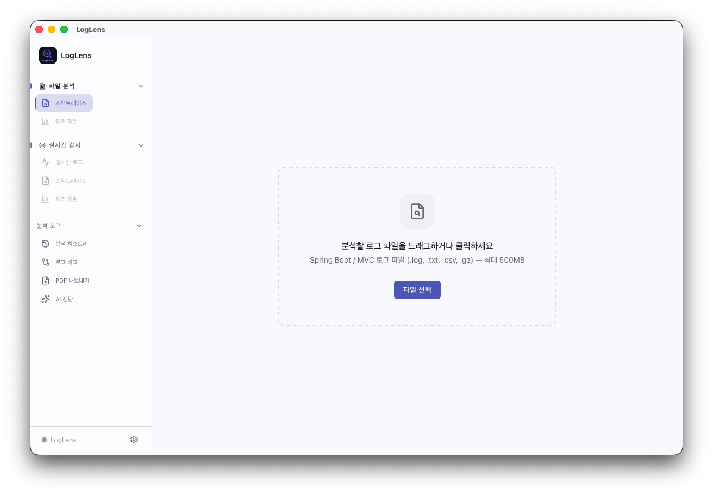
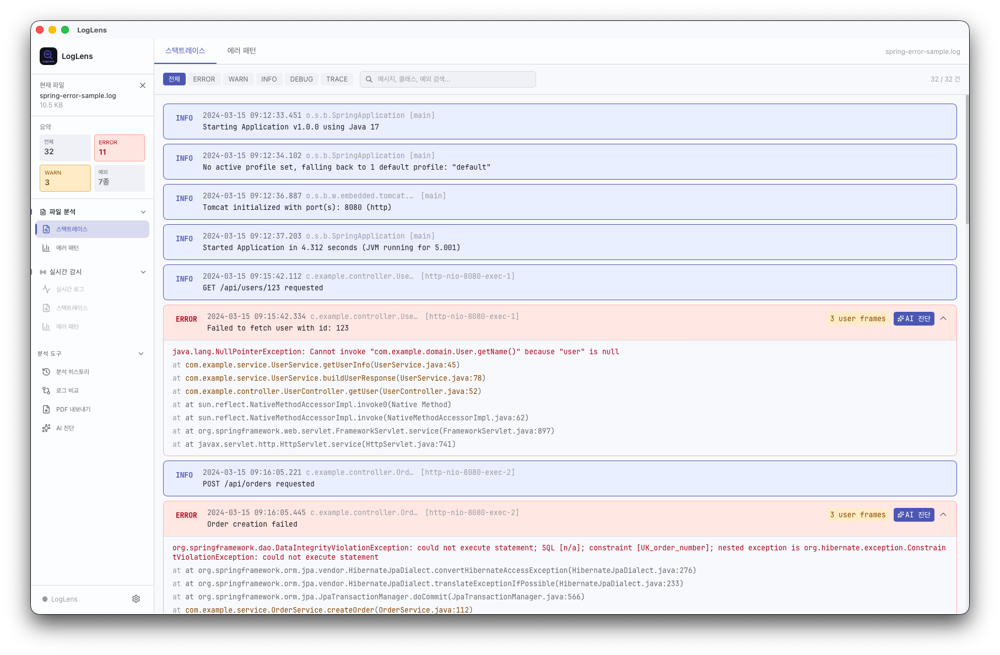
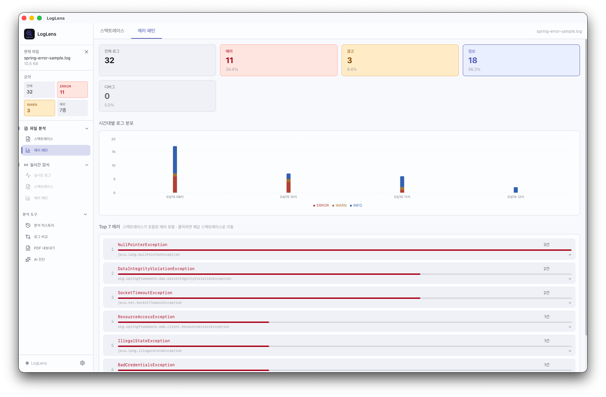
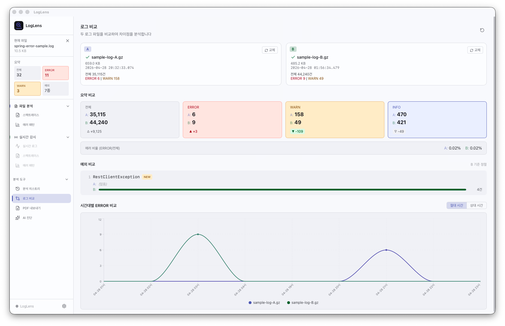
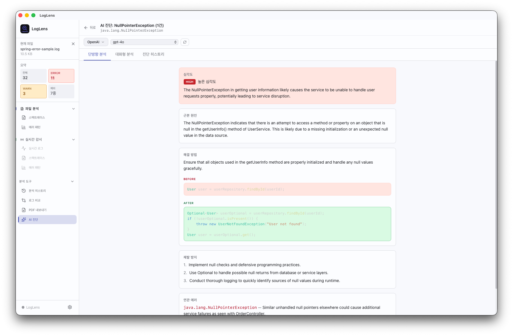

# LogLens

**Spring Boot 개발자를 위한 로그 분석 데스크탑 앱**
*A log analysis desktop app for Spring Boot developers*



---

## 소개 | About

LogLens는 Spring Boot 애플리케이션의 로그 파일을 분석하는 오프라인 데스크탑 앱입니다.
망분리 환경, 인터넷이 제한된 환경에서도 완전히 동작합니다.

LogLens is an offline desktop app for analyzing Spring Boot application logs.
It works fully in air-gapped and restricted network environments.

---

## 주요 기능 | Features

### 무료 기능 | Free Features

| 기능 | 설명 |
|------|------|
| 📂 파일 분석 | 로그 파일 드래그앤드롭, 스택트레이스 파싱 |
| 📊 에러 패턴 | 예외 유형별 빈도, 시간대별 분포 차트 |
| 📡 실시간 감시 | 로그 파일 실시간 모니터링 (tail -f) |
| 🕐 분석 히스토리 | 과거 분석 기록 저장 및 재열람 |
| 🔄 로그 비교 | 두 로그 파일 에러 패턴 비교 분석 |
| 📄 PDF 내보내기 | 분석 결과 PDF 리포트 생성 |
| 🤖 AI 리포트 | AI 기반 장애 보고서 / 점검 보고서 자동 작성 |
| 🔍 AI 진단 | 에러 원인 분석, 해결 방법 제시, 대화형 분석 |

### AI 프로바이더 지원 | Supported AI Providers
- Claude (Anthropic)
- OpenAI
- Google Gemini
- 로컬 LLM (Ollama / LM Studio) — **망분리 환경에서도 사용 가능**

---

## 스크린샷 | Screenshots

| 파일 분석 | 에러 패턴 |
|-----------|-----------|
|  |  |

| 로그 비교 | AI 진단 |
|-----------|---------|
|  |  |

---

## 설치 방법 | Installation

### 다운로드 | Download

[GitHub Releases](https://github.com/NetMD/loglens/releases) 페이지에서
운영체제에 맞는 파일을 다운로드 후 바로 실행하세요.

Download the file for your OS from the [GitHub Releases](https://github.com/NetMD/loglens/releases) page and run it directly.

| OS | 파일 |
|----|------|
| macOS (Apple Silicon / Intel) | `LogLens_x.x.x_aarch64.dmg` / `LogLens_x.x.x_x64.dmg` |
| Windows | `LogLens_x.x.x_x64-setup.exe` |

> 별도 설치 없이 바로 실행 가능합니다.
> No installation required. Just download and run.

---

## 직접 빌드 | Build from Source

```bash
# 요구사항 | Requirements
# - Node.js 18+
# - Rust (rustup)
# - pnpm

git clone https://github.com/NetMD/loglens.git
cd loglens
pnpm install
pnpm tauri build
```

---

## 지원하는 로그 형식 | Supported Log Formats

```
# 표준 Spring Boot 로그 패턴
2024-03-15 09:15:42.334 ERROR 23456 --- [http-nio-8080-exec-1] c.example.service.UserService : 메시지

# Spring Boot 3.x ISO 8601 포맷
2024-03-15T09:15:42.334+09:00 ERROR 23456 --- [http-nio-8080-exec-1] c.example.service.UserService : 메시지
```

---

## 오픈소스 라이선스 | Open Source Licenses

이 프로젝트는 MIT 라이선스로 배포됩니다.
This project is distributed under the MIT License.

사용된 오픈소스 라이브러리 목록은 [THIRD_PARTY_LICENSES.md](./THIRD_PARTY_LICENSES.md) 를 참고하세요.
For the list of open source libraries used, see [THIRD_PARTY_LICENSES.md](./THIRD_PARTY_LICENSES.md).

---

## 기여 | Contributing

버그 리포트, 기능 제안, PR 모두 환영합니다.
Bug reports, feature requests, and PRs are all welcome.

---

## 개발자 | Developer

1인 개발자로 개발자와 소규모 팀을 위한 유용한 도구들을 만들고 있습니다.
Solo developer building useful tools for developers and small teams.

- GitHub: [@NetMD](https://github.com/NetMD)
